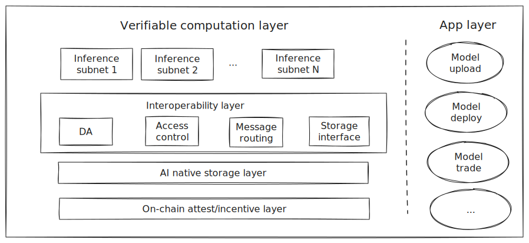

# Architecture

The Architecture of UniBase is depicted in the above figure as a multi-layered architecture designed to facilitate decentralized AI services, ensuring scalability, security, and interoperability within its ecosystem.

<figure><figcaption></figcaption></figure>

### Technical characteristics

Compared to other public blockchains, Unibase maintains equivalent performance while leveraging fraud proofs to achieve on-chain reasoning proofs.

<table data-full-width="false"><thead><tr><th></th><th align="center">Unibase</th><th align="center">Ethereum</th><th align="center">Celestia</th><th align="center">EigenDA</th><th align="center">Avail</th><th align="center">0G</th></tr></thead><tbody><tr><td>Data Verification</td><td align="center">
On-chain

(Ethereum)
</td><td align="center">-</td><td align="center">Off-chain</td><td align="center">Off-chain</td><td align="center">Off-chain</td><td align="center">Off-chain</td></tr><tr><td>Data Security</td><td align="center">Honest One</td><td align="center">Honest Majority</td><td align="center">Honest Majority</td><td align="center">Honest Majority</td><td align="center">Honest Majority</td><td align="center">Honest Majority</td></tr><tr><td>Data Throughput</td><td align="center">100GBPS</td><td align="center">0.083MBPS</td><td align="center">1.5-10MBPS</td><td align="center">10MBPS</td><td align="center">-</td><td align="center">50GBPS</td></tr><tr><td>Consensus</td><td align="center">None</td><td align="center">Ghost and casper</td><td align="center">Tendermint</td><td align="center">None</td><td align="center">Base and Grandpa</td><td align="center">Tendermint</td></tr><tr><td>Support DAS</td><td align="center">Yes</td><td align="center">No</td><td align="center">Yes</td><td align="center">No</td><td align="center">Yes</td><td align="center">Yes</td></tr><tr><td>Encoding Proof Schema</td><td align="center">Fraud Proofs</td><td align="center">Validity Proofs</td><td align="center">Fraud Proofs</td><td align="center">Validity Proofs</td><td align="center">Validity Proofs</td><td align="center">Validity Proofs</td></tr><tr><td>DA Settlement</td><td align="center">Ethereum</td><td align="center">Ethereum</td><td align="center">Celestia</td><td align="center">Ethereum</td><td align="center">Avail</td><td align="center">0G Chain</td></tr></tbody></table>

### Feature comparision

Comparing to other AI projects in the Web3 space, Unibase carefully considered the strengths and weaknesses of various projects and ultimately created a project that encompasses nearly all of their features.

| Feature                                     | Unibase | io.net | Bittensor | Akash | Golem(GLM) | Sahara |
| ------------------------------------------- | ------- | ------ | --------- | ----- | ---------- | ------ |
| Verifiable Computing                        | Y       | N      | N         | N     | N          | Y      |
| Support AI Subnet                           | Y       | N      | Y         | N     | N          | N      |
| Model & AI Server One-Button Deployment     | Y       | Y      | N         | Y     | N          | -      |
| Composability between AI Servers            | Y       | -      | -         | -     | -          | -      |
| Native Support for AI Server Economic Model | Y       | -      | Y         | N     | N          | -      |
| Permissionless Computing Network            | Y       | Y      | Y         | Y     | Y          | Y      |
| Native Decentralized AI Data Network        | Y       | N      | N         | N     | N          | -      |
| Native Data Marketplace                     | Y       | N      | N         | N     | N          | Y      |
| Protect the Privacy of Users’ Data          | Y       | -      | N         | Y     | -          | Y      |

