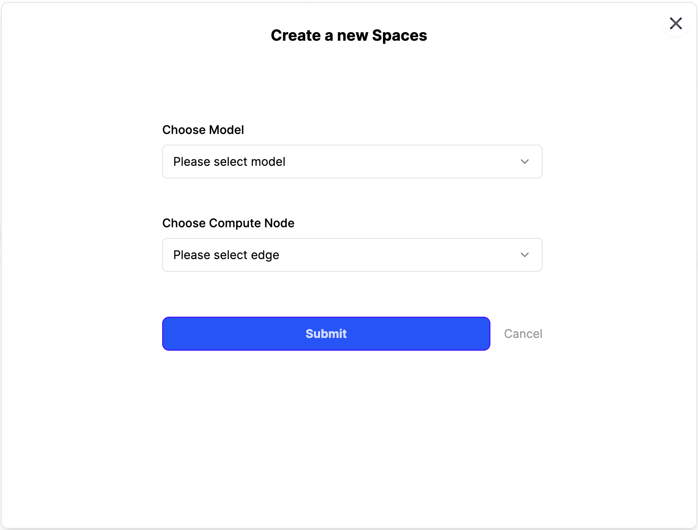
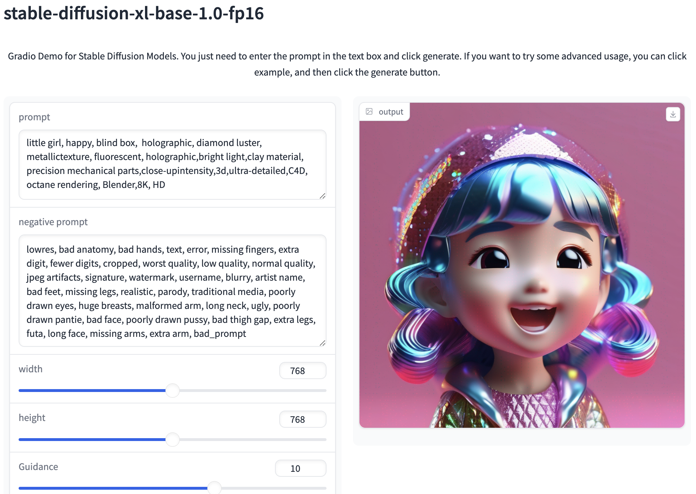
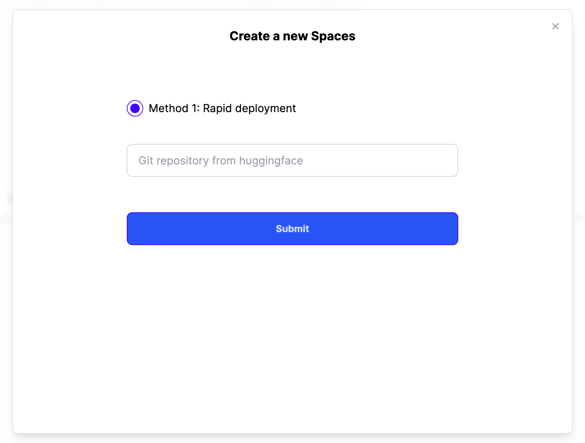

# Space

Unibase Spaces make it easy for you to create and deploy ML-powered demos in minutes.

There are two ways to create a new space.

#### Create on Unibase chain

Deploying AI Applications on Unibase's Distributed Network.

Submit after selecting the available model and the corresponding computing node, and wait patiently for the model to be deployed successfully.

<figure><figcaption></figcaption></figure>

Once the deployment is complete, you can use the model.

<figure><figcaption></figcaption></figure>

#### Create on Cloud services

Deploying AI Applications on Traditional Cloud Servers.

Simply enter the the HuggingFace Git repository url and wait for deployment.

<figure><figcaption></figcaption></figure>

